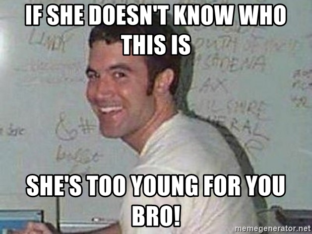
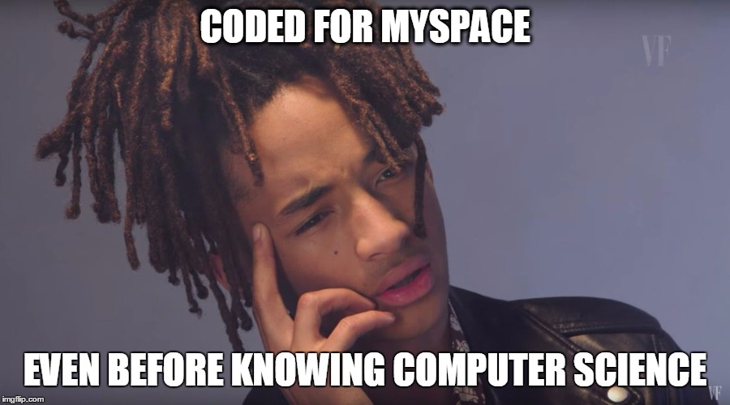

Previous to taking ICS 314, I had a small amount of prior knowledge on coding in Javascript and have used it here and there in adding flair to websites that I would build for fun, so Javascript isn’t completely new to me. All in all, I think that Javascript is actually a great language to dip your toes into if you’re interested in coding. Is it the best language to choose to learn first? I don’t know. I don’t even know if I believe that there actually is one language out there that is hands down **_the best_** for first timers. I think what matters more is that whatever language you do choose to learn, you do it properly. Meaning, you’re forming good habits, learning the core fundamentals, and actually understanding what you’re doing. 

However, for numerous reasons, I believe that Javascript could be a great prospect.

* Easy to get started: You don’t need a special compiler and there’s no need for downloading anything special. Every computer has a browser and a notepad!
* ‘Instant’ results: A few lines of code alongside HTML/CSS and you got user interaction and a lively webpage.
* It’s popular: As long as there is internet, there will be webpages, and any platform that matters has support for it.
* It’s everywhere: It’s the default language of the web and it’s not going anywhere anytime soon.
* It’s easy to learn: The syntax is easy to pick up.
* Great job market: Everyone needs a webpage, amirite?
* Universal uses: Everyone has something to say (businesses, bloggers, photographers, etc.)
  
“But wait, I don’t know HTML and CSS…..”

## Showing My Age
 Anyone who ever had an ‘Asian Avenue’, ‘Xanga’, or ‘Myspace’ page knows at least a little bit of HTML and CSS. As embarrassing as it is, I can still recall the very first img tag I wrote to display an oversized picture of Paul Walker under the ‘Likes’ section. I know, I’m cringing too.

When you really think about it, though, the reason everyone was able to pick up on the basics so easily was because it IS easy. The syntax is easily readable by the average person and it just makes sense. 

```
<div>
	background-color: red;
	width: 100 px;
	height: 100 px;
	font-family: Arial;
</div>
```

With this in mind, the fact that you need to have knowledge of HTML and CSS for Javascript shouldn’t discourage you at all.

## Same, same, but different.
 Not counting the days of decking out our ‘Myspace’ pages with HTML, Java was the first language I ever officially learned.  Is it different compared to Javascript? Yes, duh. Do I prefer it over Javascript? Yes, actually. Although I suspect it might be because it was my first ‘real’ experience with a language that makes me a *bit* biased. I also had a terrific teacher for the Java courses that I took and it was Java that made me realize that this is what I wanted to be doing for the rest of my life.

Not counting the days of decking out our ‘Myspace’ pages with HTML, Java was the first language I ever officially learned.  Is it different compared to Javascript? Yes, duh. Do I prefer it over Javascript? Yes, actually. Although I suspect it might be because it was my first ‘real’ experience with a language that makes me a *bit* biased. I also had a terrific teacher for the Java courses that I took and it was Java that made me realize that this is what I wanted to be doing for the rest of my life.

However, I do know that learning Python after Java was an absolute walk in the park. Though, I’m not sure if it’s because it actually is easier or if it’s because I already knew Java. (I believe the general consensus is that it actually is easier).

The thing is, if you know the basic foundations of one language, you *kinda* know them all. At least regarding the programming languages I’ve had experience with, (Java, Python, C/C++, Javascript) I noticed that they all share the same concepts. 

* while/for loops
* if statements
* functions
* arrays
* variables

Sure, the syntax will be a bit different depending on the language, but once you know it, you pretty much got it down packed and the next language you pick up will be much, much easier to learn. 

Unless it’s C.
