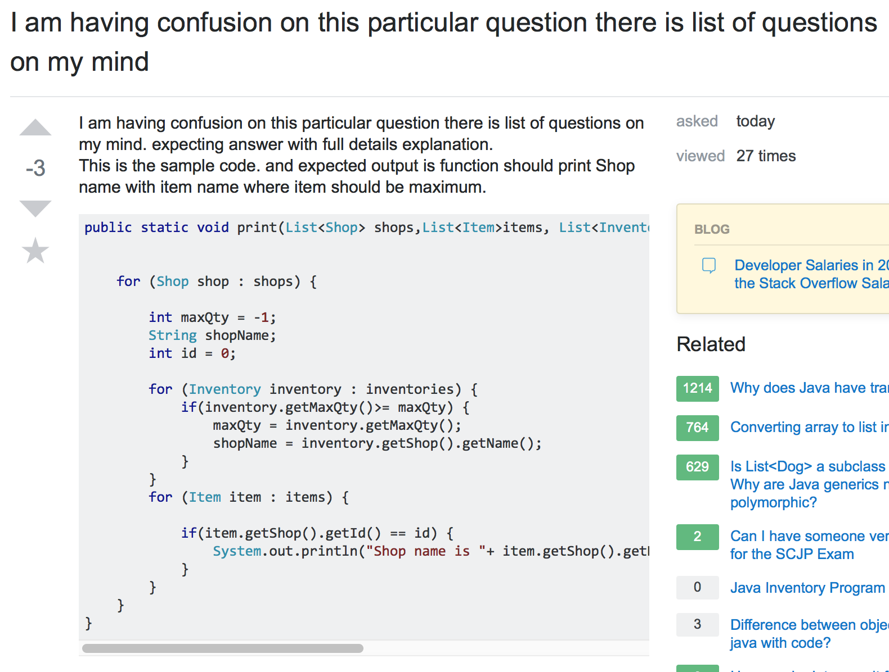
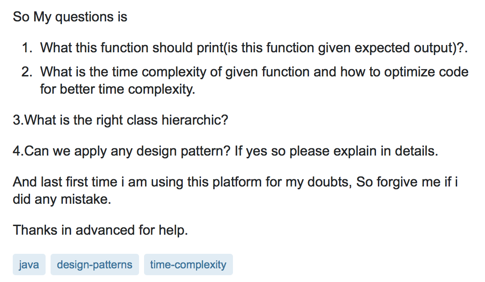

If I had a nickel for every time that I saw someone on StackOverflow looking for someone to solve their homework question for them, then I wouldn’t be writing this article right now, because I’d be sipping a Mojito on a beach on my private island that I bought with all my nickels.

StackOverflow is FULL of questions like this.  Eric Steven Raymond would be foaming at the mouth reading this post. No use of a meaningful, specific subject header, the question is definitely not written in a clear, grammatical, correctly-spelled language, nor did they attempt to do any research to try and understand the problem before hand, and the most cardinal and obvious sin of all, posting a homework question.

Asking stupid questions does not benefit anyone. Not the poster and certainly not the people who wasted time reading them. If you expect a clear, concise, and substantial answer, then ask something actually worth answering. Ask something interesting. Ask something thought provoking. If you have to ask a lackluster and trivial question, then make darn sure that you attempted to solve it yourself first and then tried to find the answers on your own and then ask your boring question in a clear, concise, and substantial way. Ask stupid questions, get rude and unhelpful answers.  That’s the way it works.

# IDK, Google it.
Google-Fu is the ability to find information on the web quickly and efficiently. It seems, unfortunately, that not a lot of people have this skill. A quick peak at StackOverflow would confirm this.

Google-Fu isn’t only a great skill to acquire and use before asking questions on forums, but every software engineer should have this skill. Just knowing how to ask a question in a certain way to yield the best results is what sets smart software engineers apart from the rest. Use words in your search that will narrow down the results for you. Good luck finding the answer that you need by asking “Why doesn’t my array update?”.  Just like asking for help in a forum, when use a search engine, be specific. What language are you using? What version? What’s the error code? You have to remember that people who are on forums like StackOverflow WANT to help people solve their problems. They’re there, un-paid, volunteering to help. Make it as easy as possible for them to understand the problem so that they actually want to help you. 

