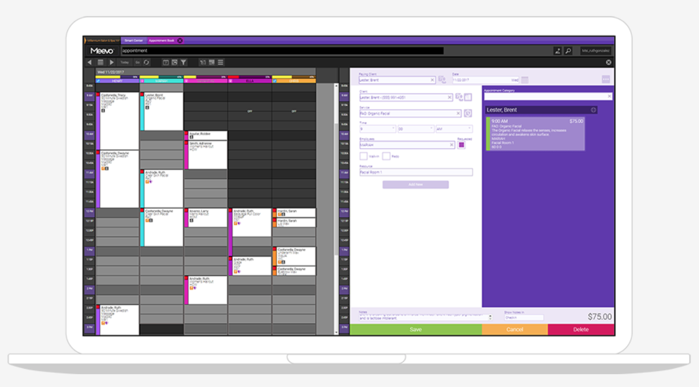
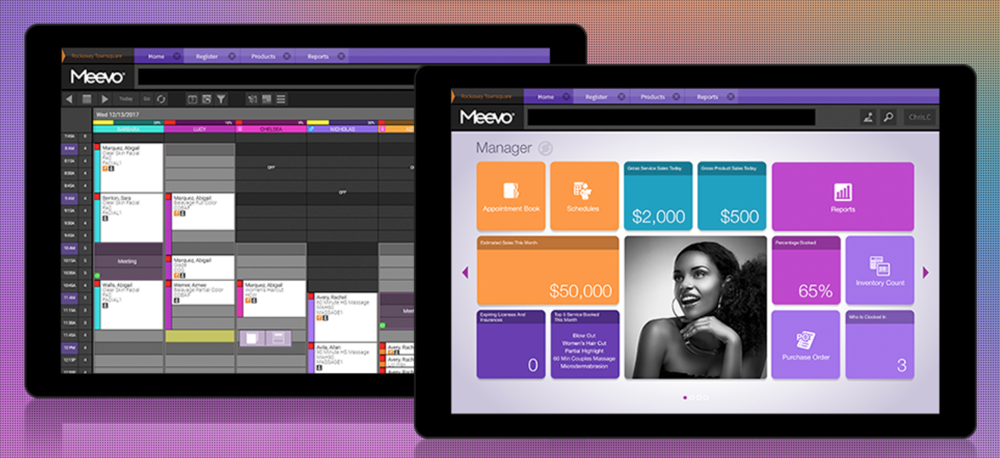
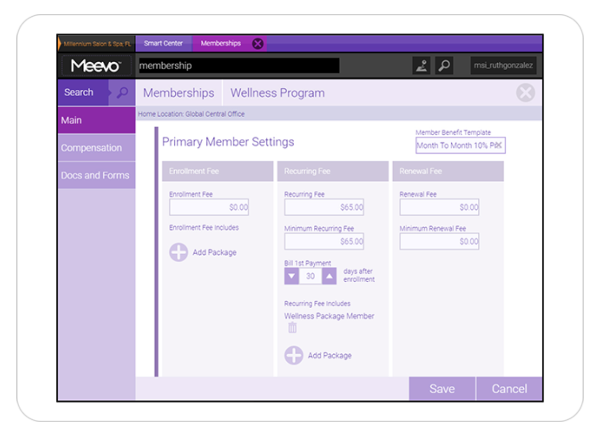

In 2012 to 2015 I worked as a Manager along side Doctors, nurses, and estheticians for a Medical Spa office. We offered procedures such as Botox, fillers, laser treatments, and numerous other services.   

One of the biggest tasks I was responsible for during my time there was installing and implementing a new patient software.  When I started my position there, we were using an application called PatientNOW, which was a very outdated and inefficient program that was responsible for storing and handling data on over 5,000 patients. It was unable to give any useful data on customer retention and   growth nor our expenses and profits. We also had to use numerous other applications, such as Quickbooks and mailchimp to handle tasks because PatientNOW was not capable of ringing up customers nor sending emails and notification reminders. 

My goal was to find one program that could do it all.  I researched over 50 different applications and set up meetings and demos with those that I believed could offer what I was interested in. A very important factor that I had to take into consideration was that it needed to be HIPAA (Health Insurance Portability and Accountability Act) compliant. Since we were responsible for keeping a file of sensitive health information on each patient, I had to ensure that the new software would keep our data protected.

I found Millennium, which is a software for salon and spas, but I knew that I could customize and program the software to fit my needs. Most importantly, it was HIPAA compliant. Now the hard part began. I was responsible for transferring all the data from all the other programs that we used into Millennium.  It was a huge undertaking to say the least.
Part of my duties included:
-	Reallocating every patient’s data from PatientNOW into Millennium. This included everything from phone numbers, addresses, emails, and more.
-	Input sales information on every single service and product that we offered such as, name, amount in inventory, prices, distributor, etc.
-	Create a system for reminder notifications via text message or email and a monthly newsletter of specials via a mailing list.
-	Set up a membership program along with membership billing (automatic reoccurring fees), special member discounts on services and products, and separate mailing list.
-	Establish an employee schedule that would sync with the appointment book to see when certain services are offered and the duration of each service (color-coded and time blocked)
-	Set up and maintain reports that would automatically generate and submit customer and finance reports.
-	Input and manage information on the current inventory for all the products that we had on hand.

I also had to set up meetings and 1 on 1 time with every employee to teach them how to use Millennium. While transferring and inputting all the data into Millennium was tedious, I believe teaching was the hardest part of this project. Let’s just say that the biggest thing that I learned during this whole process was patience. 

You can learn more about Millennium Software [here](https://www.millenniumsi.com).

