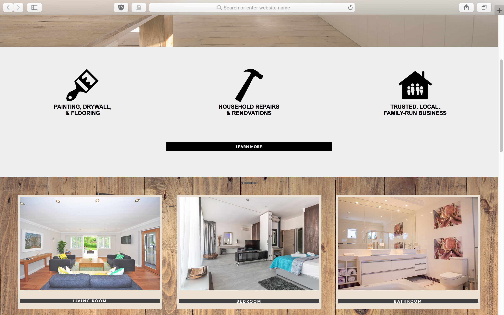
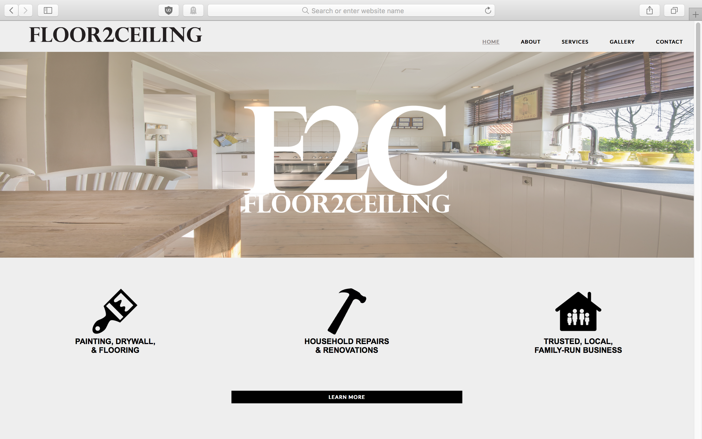
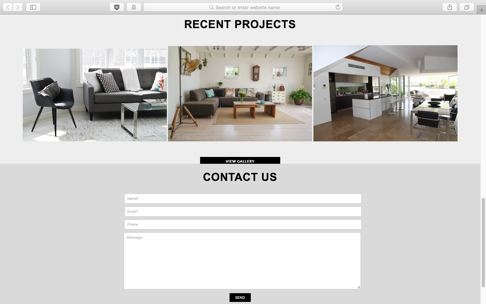

Floor2Ceiling is the first website that I ever created. I began this project as the sole developer in the Summer of 2018 during my spare time for my father's local construction business. I started this project to help me learn how to design a website using HTML and CSS.

I began this project with only basic knowledge of self-taught HTML and CSS. Everything that I learned about building this website is from various YouTube tutorials. I first started with videos to refresh myself with the basics of HTML and CSS. Eventually, I stumbled across videos on CSS Flexbox and CSS Grid. 

CSS Grid immediately sparked my interest in how simple and unique the code was. I decided to use CSS Grid to build this website because it was more recent than flexbox and I wanted to familiarize myself with the code. I also added a small bit of Javascript to add some fading flair to the large, main logo that appears as soon as you load the page. The outcome is a simple informative website with links to showcase different areas of renovation, most recent projects, and a contact form. 

In this project I gained useful experience with responsive web design, HTML, and CSS + Grid.  
 
You can see my code here: 
Source: <a href="https://github.com/meowcedez/floor2ceiling"><i class="large github icon"></i>meowcedez/floor2ceiling</a>
