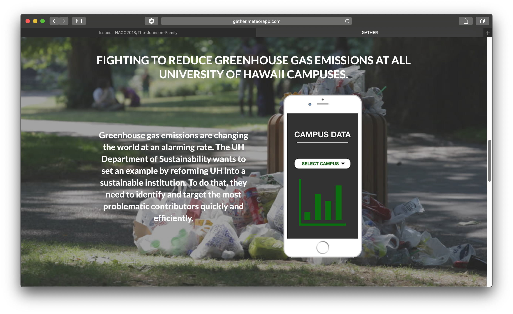
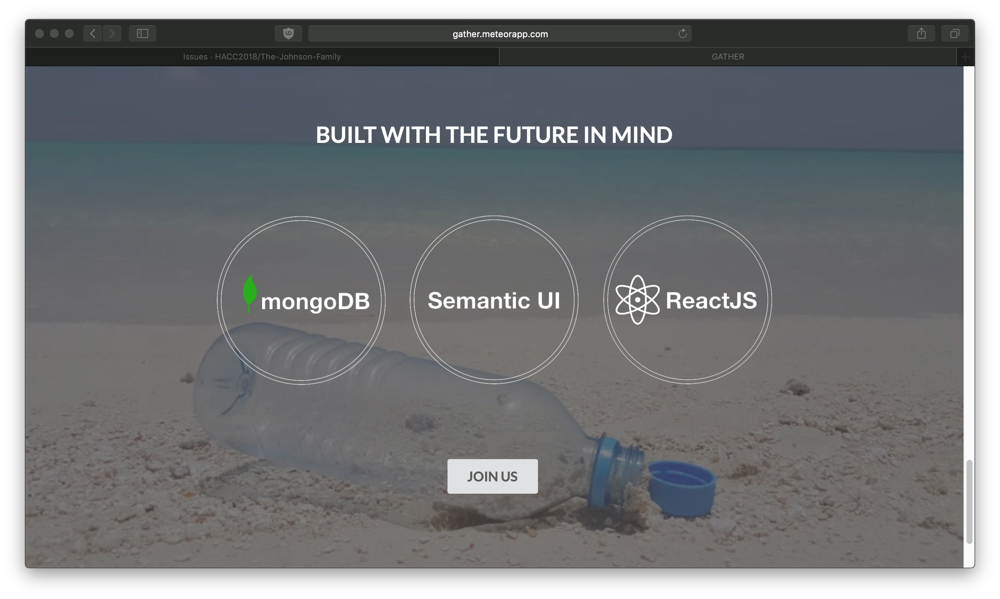

# Links

* You can view the Gather app [here](http://gather.meteorapp.com/#/).
* You can view the source code here: <a href="https://github.com/HACC2018/The-Johnson-Family"><i class="large github icon"></i>HACC2018/The-Johnson-Family</a>
* [Video Presentation](https://www.youtube.com/watch?time_continue=45&v=XZxnj_RrCKs).

Here

You can learn more about sustainability at UH Manoa [here](http://manoa.hawaii.edu/sustainability/).

