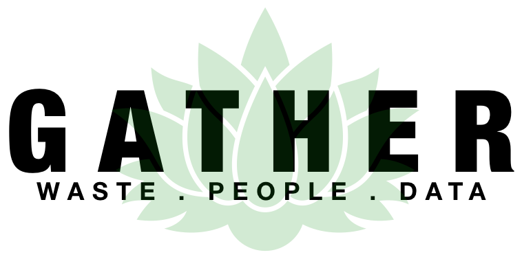
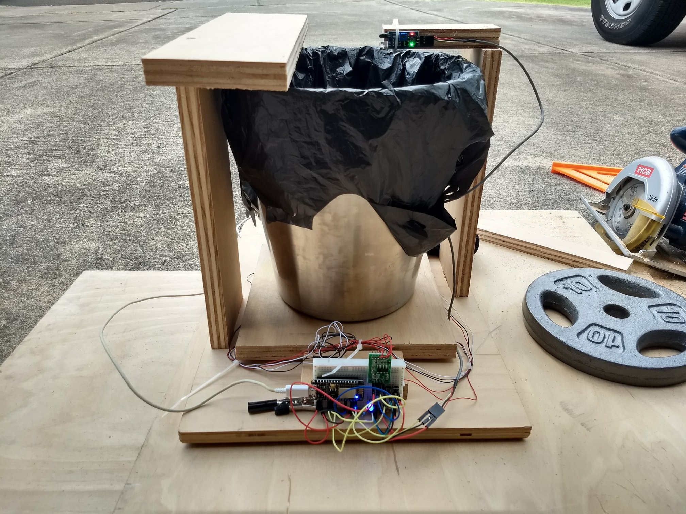
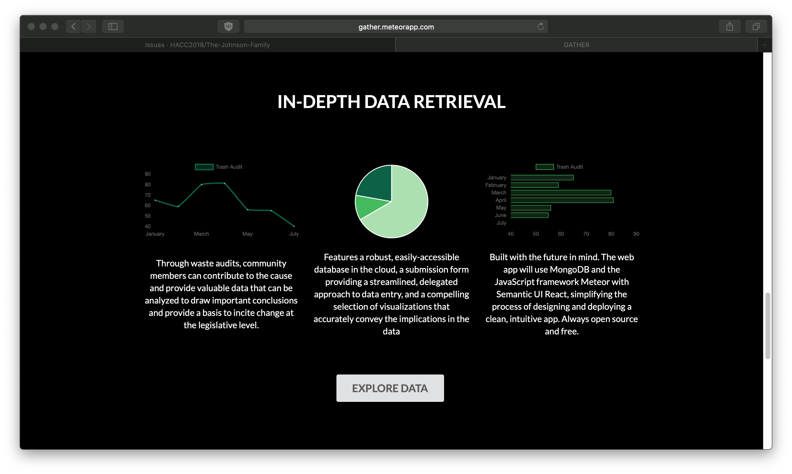

In October of 2018, I entered the Hawaii Annual Code Challenge with a group of classmates from ICS 314 Software Engineering for our final project. During the HACC kickoff event, we were presented with a series of challenges allocated by various governing departments across the state. The theme for this year’s event was ‘Sustainability’ and the challenge that our group, The Johnson Family, chose was – Trash. 

# Overview

The Department of Sustainability, or DoS, has a great process for identifying and tracking suspected contributors in waste management practices. Through waste audits, community members can contribute to the cause and provide valuable data that can be analyzed to draw important conclusions and provide a basis to incite change at the legislative level. However, once the waste audit is done, the data must be input manually by DoS personnel. In addition, the database access and storage is limited to the local level and not organized in an easily manipulable structure. This makes it difficult to visualize data to emphasize important issues and conclusions because it must be done manually through much analysis.

Our solution is a two-pronged approach involving a web app and a smart bin. Our web app “Gather” features a robust, easily-accessible database in the cloud, a submission form providing a streamlined, delegated approach to data entry, and a compelling selection of visualizations that accurately convey the implications in the data—all wrapped in a clean, simple, and intuitive user interface. Our smart bin leverages the cloud database, introducing a continuous stream of data that facilitates an increase of sample size in orders of magnitude at a much smaller cost.

In order to realize our solution, we are implementing a database in a series of collections through MongoDB. The web app will use the JavaScript framework Meteor with Semantic UI React, simplifying the process of designing and deploying a clean, intuitive app. The accompanying smart bin will be implemented using proximity and load cell sensors connected to a NodeMCU WiFi Development Board that’s programmed to push data to our database using the MQTT protocol.

# Web App Features

# Links

* You can view the Gather app [here](http://gather.meteorapp.com/#/).
* You can view the source code here: <a href="https://github.com/HACC2018/The-Johnson-Family"><i class="large github icon"></i>HACC2018/The-Johnson-Family</a>
* [Video Presentation](https://youtu.be/XZxnj_RrCKs).
* You can learn more about sustainability at UH Manoa [here](http://manoa.hawaii.edu/sustainability/).

