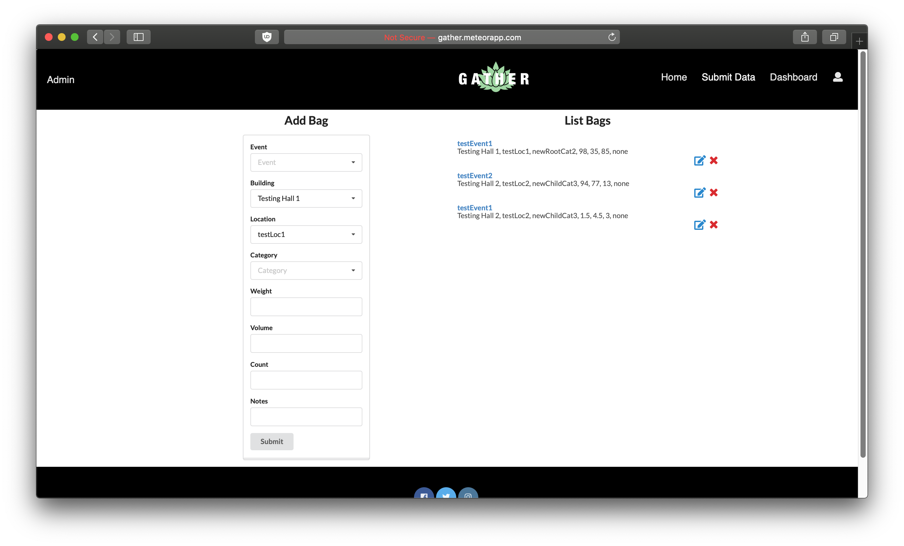
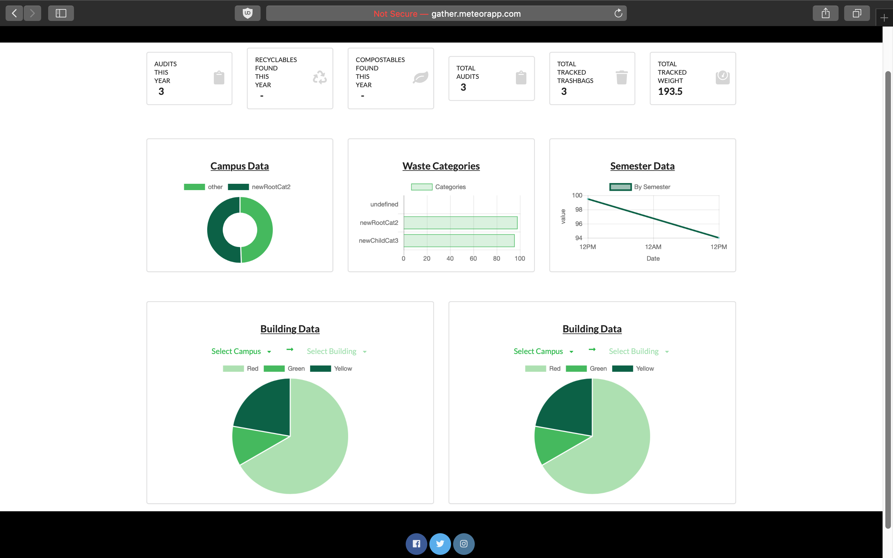
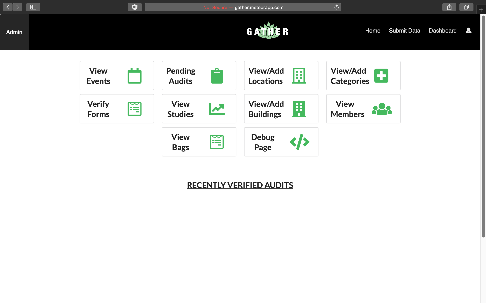

In October of 2018, I entered the Hawaii Annual Code Challenge with a group of classmates from ICS 314 Software Engineering for our final project. During the HACC kickoff event, we were presented with a series of challenges allocated by various governing departments across the state. The theme for this year’s event was ‘Sustainability’ and the challenge that our group, The Johnson Family, chose was – Trash. 

# Overview

The Department of Sustainability, or DoS, has a great process for identifying and tracking suspected contributors in waste management practices. Through waste audits, community members can contribute to the cause and provide valuable data that can be analyzed to draw important conclusions and provide a basis to incite change at the legislative level. However, once the waste audit is done, the data must be input manually by DoS personnel. In addition, the database access and storage is limited to the local level and not organized in an easily manipulable structure. This makes it difficult to visualize data to emphasize important issues and conclusions because it must be done manually through much analysis.

Our solution is a two-pronged approach involving a web app and a smart bin. Our web app “Gather” features a robust, easily-accessible database in the cloud, a submission form providing a streamlined, delegated approach to data entry, and a compelling selection of visualizations that accurately convey the implications in the data—all wrapped in a clean, simple, and intuitive user interface. Our smart bin leverages the cloud database, introducing a continuous stream of data that facilitates an increase of sample size in orders of magnitude at a much smaller cost.

In order to realize our solution, we are implementing a database in a series of collections through MongoDB. The web app will use the JavaScript framework Meteor with Semantic UI React, simplifying the process of designing and deploying a clean, intuitive app. The accompanying smart bin will be implemented using proximity and load cell sensors connected to a NodeMCU WiFi Development Board that’s programmed to push data to our database using the MQTT protocol.

# Web App Features

Upon registering or signing in to your account, you may submit data from a trash audit event. The information will then be sent to an administrator to await verification. 

Once the pending records are verified to be accurate, the data will then be sent to dashboard. The dashboard was custom designed to present data that Department of Sustainability was interested in. The data is dynamically allocated and updates in real time. 

When logged in as an administrator, you are able to view the ‘Admin’ page. This page allows the user to view and accept incoming data, customize visualizations in the data, and view more in-depth statistics.

# My Contribution

As part of the front end team, I was responsible for the design and user experience aspect of the application. To achieve this, I used a mix of Javascript, CSS, SemanticUI, and React. A few of my core contributions and features that I developed were:

* Landing Page
* Admin Page
* Dashboard Page
* Graphics Design
* Video Production

My biggest challenge during this competition was understanding the back end functionality. As someone with no prior knowledge of database systems, being able to extract data from the database to accurately deploy and display in the application was a complicated and perplexing task. Due to the time limitations for the event we were also unable to implement many other additional features, such as a ‘Organizations’ page were groups can create and market waste audit events and a reward system as incentive for students to actively participate and contribute to zero waste practices.

Although participating in this event was without question an extremely valuable learning experience, I must say that these events are not for the faint of heart. Besides juggling due dates and midterm exams from other classes, being able to efficiently time manage my schedule to meet the constraints of my fellow team members became a persistent struggle. The ability to work well under pressure and along side a team with various different strengths, weaknesses, personalities, and time restraints quickly became a must. I believe that this experience has made me not only a more knowledgeable programmer, but also taught me tremendously valuable lessons  on how to work with a team.

# Links

* You can view the Gather app [here](http://gather.meteorapp.com/#/).
* You can view the source code here: <a href="https://github.com/HACC2018/The-Johnson-Family"><i class="large github icon"></i>HACC2018/The-Johnson-Family</a>
* [Video Presentation](https://youtu.be/XZxnj_RrCKs).
* Learn more about [sustainability at UH Manoa](http://manoa.hawaii.edu/sustainability/).

